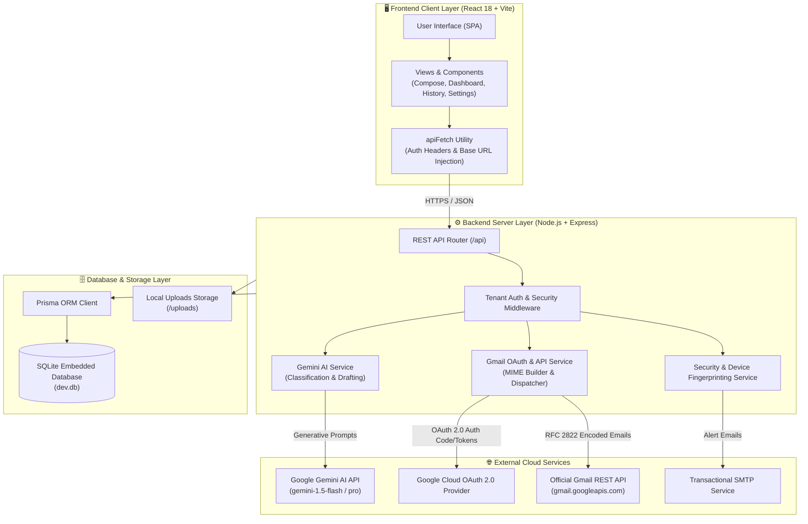
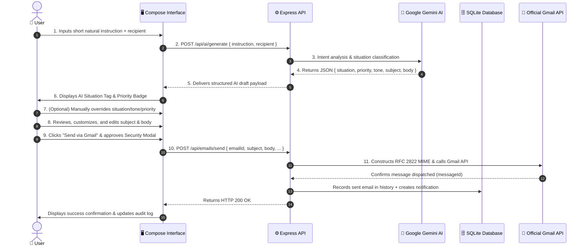
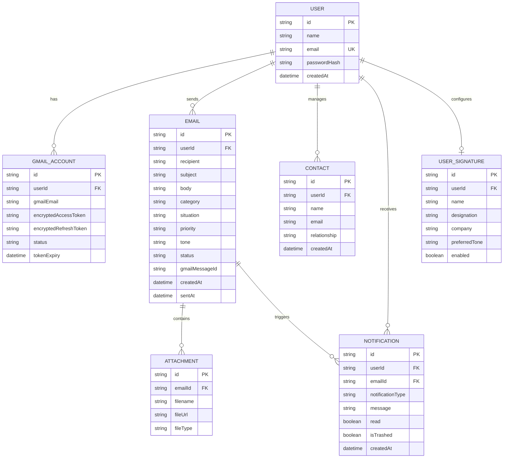

# 🏛️ Scribe-AI System Architecture & Workflow Deep Dive

This document details the high-level architecture, end-to-end data pipelines, security models, and system interactions powering **Scribe-AI**.

---

## 📐 1. System Architecture Overview



---

## ⚡ 2. The 11-Step Human-in-the-Loop AI Email Workflow

Scribe-AI prioritizes email accuracy, human verification, and zero accidental sends through a rigorous 11-step human-in-the-loop workflow:



---

## 🔐 3. Security & Multi-User Isolation Model

### Multi-Tenant Isolation
1. **User Identifier Injection**: Every request sent via [`apiFetch`](file:///c:/Users/testm/Desktop/AI-Email/client/src/utils/api.js) automatically injects the `x-user-email` and `Authorization: Bearer` headers.
2. **Server-Side Verification**: Backend routes strictly query the database using the authenticated `userId`:
   ```javascript
   const user = await prisma.user.findUnique({ where: { email: userEmail } });
   const userEmails = await prisma.email.findMany({ where: { userId: user.id } });
   ```
3. **OAuth Token Security**: Connected Google OAuth tokens (`encryptedAccessToken`, `encryptedRefreshToken`) are scoped strictly to the authenticated user's ID.

### Device & Login Fingerprinting
On every sign-in attempt:
1. The backend parses the client's `User-Agent` to determine the browser (e.g. Chrome, Firefox) and Operating System (Windows, macOS, Linux, iOS, Android).
2. The client's IP address is extracted from `x-forwarded-for` or socket connection.
3. A security log entry and in-app notification are generated.
4. If configured, a transactional security notification is dispatched to notify the user of new device logins.

---

## 📊 4. Database Entity-Relationship Diagram (ERD)


